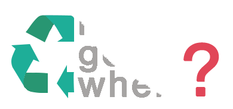

# RecycleGoWhere

<p align="center">
    
</p>

Project Page: https://better.notion.site/RecycleGoWhere-1322027374844592ad12db971a234408

## Project Introduction

**Project Goal**: To combat inaction/apathy towards recycling, we plan to create awareness/empathy using social influence, then help consumers actively change their behaviour by making recycling convenient via a technological tool.

## How to Run this Code

### Frontend Server (client folder)

Go to `client` folder via the following command:

```sh
cd client
```

Following this, install necessary node packages:

```sh
npm install
```

Next, run a production build:

```sh
npm run build
```

Start the application:

```sh
npm start
```

## Codebase Structure

The file content is primary in the `client` folder. The `data_science` folder is for future data science implementations.

### Client Folder
`__tests__`: Page to set up unit tests.
`api`: API calls to Sheety and other platforms are set up here.
`app-context`: React Context is set up in here for ease of transmitting data between pages.
`components`: Components from spa-pages will be abstracted into this folder.
`hooks`: Custom hooks are created in this folder.
`layouts`: Reusable layouts like the BasePage container are created in this folder.
`pages`: Currently stores the index page and connects to `spa-pages`
`public`: Image repository
`spa-pages`: This is where the pages for our Single Page Application are stored.
`theme`: General naming conventions for colors, classes etc.

## better.sg

This is a nonprofit volunteer-run project by better.sg.

<a href="https://better.sg/join.html">
  </a>

## License

This project is licensed under the [MIT License.](LICENSE)
