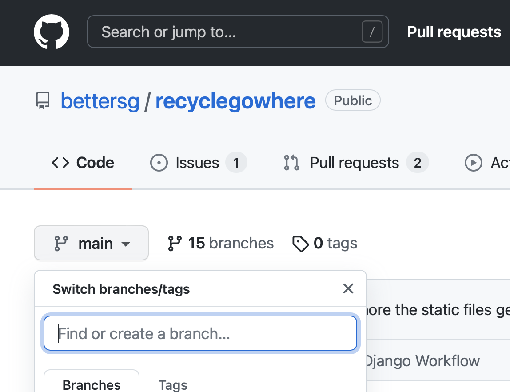
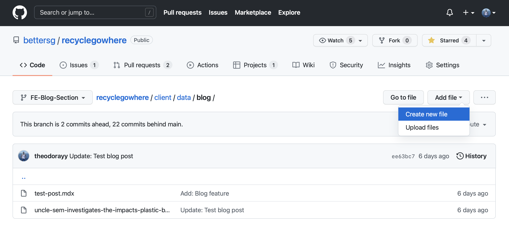
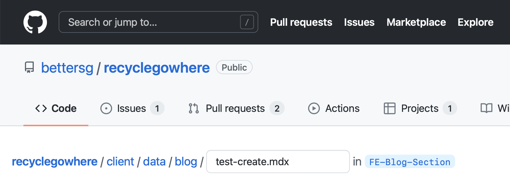
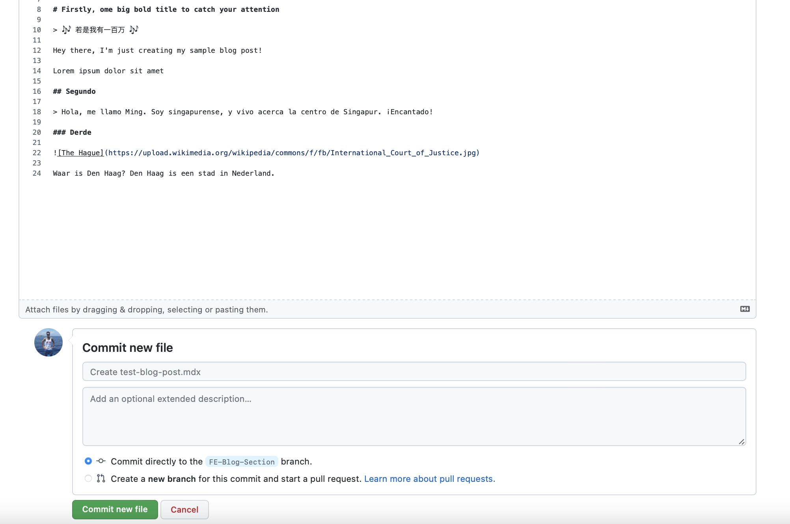
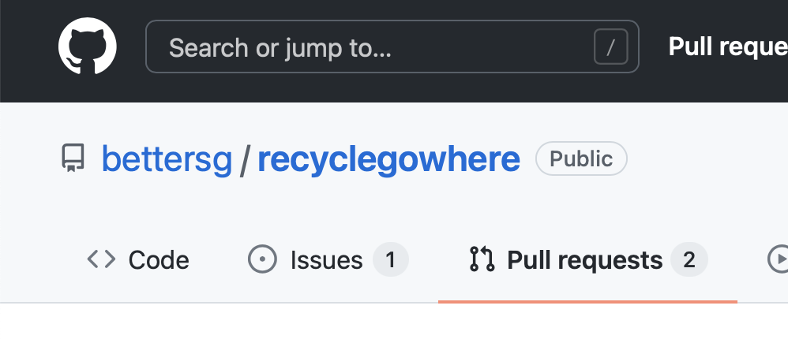
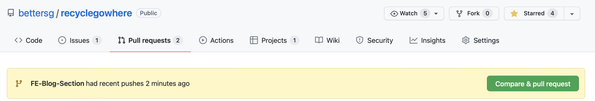
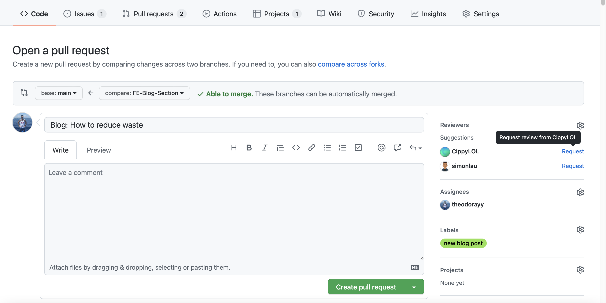
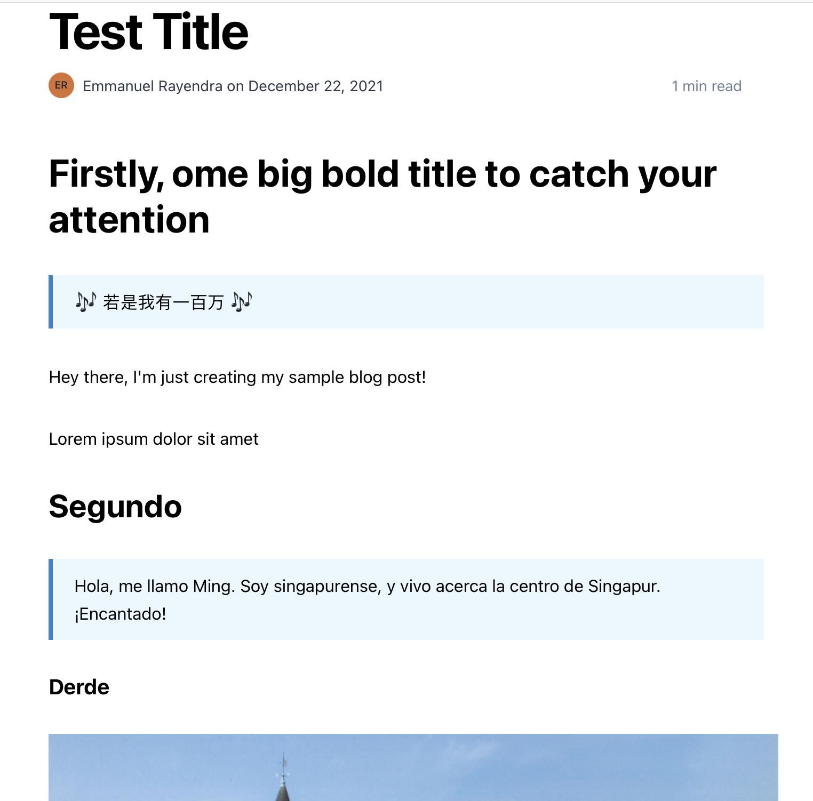

# 🚀🚀 Blog Readme 

> Ideally let's use an active branch for posting the blog contents...

♻️ `Reduce, Reuse, Recycle` ♻️

Hey there, welcome to the **Blog Branch**. Here, we'll post articles and content related to the 3Rs in Singapore. Hopefully, this will drive traffic and improve SEO rankings!

***To create a post, here's how to do it:***


## Selecting blog branch

To limit access to development files and branches, let's select the blog branch by clicking on `main` on the upper-left corner of our code repository, as shown below:



Then, click on the `<yet undecided branch name>` branch.


## Creating a post 📝

1. Navigate to `recyclegowhere/client/data/blog/` folder and create an `.mdx` file by clicking on the top right **Add file > Create new file** button as shown below:

    

2. Type in your desired article name as the file name. Note that this will be the _slug_ (or URL parameter) for your blog post.

    For example, if I'd like to see my URL as `https://recyclegowhere.org/uncle-sem-investigates-the-impacts-plastic-bottle`, my file name will be `uncle-sem-investigates-the-impacts-plastic-bottle.mdx` – as shown below:

    

3. Key in the following code to the start of your `.mdx` file:

    ```
    ---
    title: 'Test'
    publishedAt: '2021-12-15'
    summary: 'Test123'
    author: 'Emmanuel Rayendra'
    ---
    ```

    In `title`, type in your article name. Using my example above, my title will be `"Uncle Sem Investigates: The impacts of plastic bottles"`.

    In `publishedAt`, please key in today's date in the following fashion: `YYYY-MM-DD`.

    In `summary`, here you can state the summary of your article.

    In `author`, kinda _self-explanatory_ yeah? 🙃

***Once that's out of the way, you can start crafting your content! You could also refer to our past blog posts for examples...***

## Formatting the content

> For images, please refer to the below section on 'Inserting images'...

To format, click [here](https://www.markdownguide.org/basic-syntax/) for a list of Markdown formatting. 

It might seem a bit archaic at first, but trust us – it's one of the most intuitive formatting once you get used to it!

## Inserting images

We wanted to centralise all public assets, thus if you'd like to add images (which is definitely encouraged for articles and blogs!), please do so by:

1. To insert an image into the `.mdx` file, use the below code snippet:


    For local assets:

    ``````

    **OR**

    for assets from the internet:

    ``````

    **Explanation:**

    Note that within the square brackets `[]` is where you'd give a short description or caption of the image.

    Within the parentheses `()` is where you could specify the link to your image. 
    
    If the image you're using is your own, **please use the format below and upload it to the `recyclegowhere/client/public/images/blog/` folder.**

    If the image you're using is from a web source (URL), please just paste the URL into the parentheses `()`.

## Committing post

Preview your formatting by clicking on the **Preview** tab. Don't worry – the images will not appear in preview; this is expected!

If you're satisfied with the formatting and the content of your blog post or article, head to the **Commit new file** section below the blog post:



In the title, you can give a name to your changes. For example, ***New post: Test blog post***

Optionally, you could add description to your posts.

Definitely ensure that the ***"Commit directly to the `<yet undecided branch name>` branch" option is selected.***

## Publishing post

Once you've committed your post to be published, please go to the Pull Request tab at the top:



Create a pull request (PR) by clicking on **Compare & pull request**:



### Left Column

- Under the title, specify any title for your request. It could be your blog post name, ***but please begin with "Blog:"***

### Right Column

- Under reviewers on the right column, please **click on the gear icon** to get another member to merge and/or proofread your blog post to the main website.

- Ideally, you'd like to get two people to review: a proofreader, and a member from the development team. 

    > If the proofreader is unavailable, just get a developer to assist!

- Under assignees, you can assign yourself.
- Under labels, please select the `new blog post` label.

Once done, your PR should look like this:



## 🥳 Congratulations! 🎉

**Nice**, you've created your first blog post! It should look like this:

